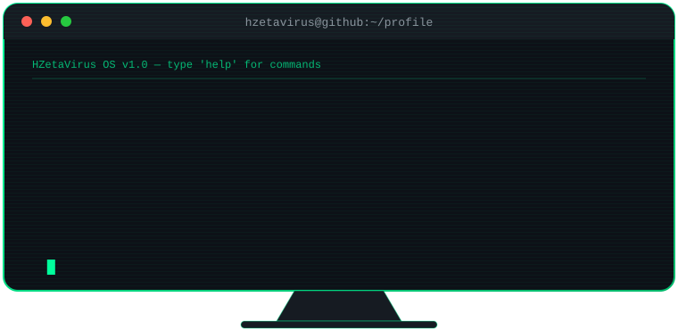

<!-- Header animado -->


<!-- Texto digitando -->
<div align="center">
  <a href="https://git.io/typing-svg">
    
  </a>
</div>

<br>

<div align="center">
  
  
  
  
</div>

---

## 💻 `whoami`

```bash
$ whoami
jeferson@hzetavirus

$ cat about.txt
Desenvolvedor Web e Mobile 👨‍💻
Estudando Node.js e Full-stack no bootcamp da Dio.me (parceria com a Meutudo)
Apaixonado por tecnologia e segurança digital 🕵️

$ cat now_learning.txt
[x] Node.js
[x] Mobile Full-stack
[x] Automação com n8n
[ ] Ethical Hacking  <-- em andamento
```

---

## 🛠️ `stack --list`

<div align="center">
  
</div>

---

## 📊 `stats --github`

<div align="center">
  
</div>

<div align="center">
  
  
</div>

<div align="center">
  
</div>

---

## 🚀 `projects --status`

| Projeto | Descrição | Status |
|---|---|---|
| 🍔 **Sistema de Delivery** | Interface moderna e responsiva para pedidos online (HTML + Tailwind CSS) |  |
| 🤖 **Cardápio Digital + n8n** | Automação de pedidos e interação com agentes digitais |  |

> ⚠️ Alguns projetos estão privados por enquanto, mas sempre em evolução!

---

## 🐍 `contributions --snake`

<div align="center">
  
</div>

---

## 📡 `contact --open`

<div align="center">
  <a href="https://github.com/HZetaVirus"></a>
  <a href="https://www.linkedin.com/in/jeferson-ribeiro-hosken-dos-santos-8ab384217/"></a>
</div>

<br>

<div align="center">
  
</div>


### ⚡ Curiosidade
Sou fascinado por segurança digital 😄.

<!--
Você pode adicionar um banner no topo do seu perfil (como imagem de capa), colocar os repositórios públicos em destaque e ir atualizando esse README conforme for ganhando experiência, projetos ou certificações.
-->
